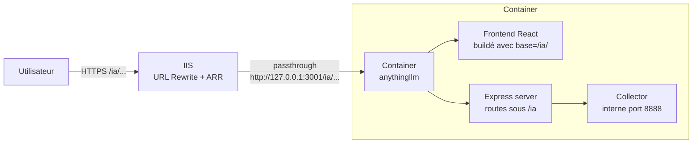

# Plan — Rebuild AnythingLLM avec base URL `/ia/` native (frontend + backend)

> **Nouvelle approche (remplace le plan précédent nginx+sub_filter)**
> L'utilisateur souhaite rebuilder AnythingLLM depuis les sources pour que le frontend React **et** le backend Express soient nativement servis sous `/ia/`, au lieu d'utiliser un reverse proxy nginx avec `sub_filter`.

> **Contexte confirmé :**
> - VM Windows avec IIS en frontale (URL Rewrite 2.1 + ARR 3.0 déjà installés).
> - Un seul FQDN, plusieurs apps via context path. Subpath cible : **`/ia/`**.
> - Sources complètes du repo `anything-llm` présentes localement (`frontend/`, `server/`, `collector/`).
> - Dockerfile multi-stage déjà en place dans `docker/Dockerfile` (build du frontend via Vite, puis copie vers `/app/server/public`).
> - Compose `docker/docker-compose.yml` déjà configuré pour builder depuis ces sources (`build.context: ../.`).
>
> **Décisions validées par l'utilisateur :**
> - **Variante A** retenue : paramétrable via variable d'environnement `BASE_PATH`.
> - **Binding Docker** restreint à la loopback : `127.0.0.1:3001:3001`.
> - **Documentation vendor** : créer `docs/vendor-dependencies.md`, pas d'objectif d'upstream Mintplex-Labs (déploiement interne uniquement).

---

## 1. Pourquoi cette approche ?

L'approche précédente (reverse proxy nginx + `sub_filter` HTML/JS) a des limites documentées par les issues Mintplex-Labs : fragilité aux upgrades, patterns hardcodés qui échappent aux regex (`window.location`, concaténations JS…), dépendance à une couche de réécriture opaque.

Puisque les sources sont présentes et le Dockerfile permet un build complet, on peut **corriger le problème à la racine** : modifier le frontend pour qu'il soit nativement buildé avec `base: /ia/`, et le backend Express pour monter toutes ses routes sous `/ia`. Résultat : AnythingLLM répond correctement à `http://<conteneur>:3001/ia/...` sans aucune réécriture.

IIS peut alors faire un reverse proxy **trivial** (pass-through sans transformation de contenu) vers `http://127.0.0.1:3001`.

---

## 2. Inventaire des modifications (issu de l'analyse du code)

### 2.1 Côté frontend (Vite + React + React Router)

| Fichier | Ligne(s) | Changement |
|---|---|---|
| `frontend/vite.config.js` | 11 | Ajouter `base: process.env.VITE_BASE_URL || '/'` dans `defineConfig(...)` |
| `frontend/src/main.jsx` | 17 + 394 | Passer `{ basename: import.meta.env.BASE_URL.replace(/\/$/, "") \|\| "/" }` en 2ᵉ arg de `createBrowserRouter(...)` |
| `frontend/src/utils/constants.js` | 1 | Inchangé — `API_BASE` reste alimenté par `VITE_API_BASE` (injecté au build) |
| `frontend/src/utils/paths.js` | 14-234 | Centraliser via un helper `withBase(path)` utilisant `import.meta.env.BASE_URL` pour préfixer tous les chemins internes (routes navigate/href) |
| `frontend/src/utils/chat/agent.js` | 19-23 | Corriger `websocketURI()` : gérer le cas où `VITE_API_BASE` est un chemin relatif (commence par `/`) — `new URL('/ia/api')` plante sinon |
| `frontend/src/components/WorkspaceChat/ChatContainer/index.jsx` | 287-289 | URL WS : remplacer `\`${websocketURI()}/api/agent-invocation/${id}\`` par `\`${websocketURI()}${API_BASE}/agent-invocation/${id}\`` (ou équivalent qui respecte le basename) |
| `frontend/.env.production` (nouveau, gitignoré) | — | Fichier créé au build dans le Dockerfile : `VITE_API_BASE='/ia/api'` et `VITE_BASE_URL='/ia/'` |

### 2.2 Côté backend (Express)

| Fichier | Ligne(s) | Changement |
|---|---|---|
| `server/index.js` | 76 | `app.use("/api", apiRouter)` → `app.use(\`${BASE_PATH}/api\`, apiRouter)` |
| `server/index.js` | 110-119 | `express.static(...)` → monté sous `app.use(BASE_PATH, express.static(...))` |
| `server/index.js` | 121 | `app.get("/robots.txt", ...)` → `app.get(\`${BASE_PATH}/robots.txt\`, ...)` |
| `server/index.js` | 126 | `app.get("/manifest.json", ...)` → `app.get(\`${BASE_PATH}/manifest.json\`, ...)` |
| `server/index.js` | 131 | `app.use("/", ...)` catch-all → `app.use(BASE_PATH \|\| "/", ...)` (le `/` doit rediriger vers `/ia/` si `BASE_PATH` est défini) |
| `server/index.js` | tête de fichier | Ajouter `const BASE_PATH = (process.env.BASE_PATH \|\| "").replace(/\/$/, "");` |
| `server/utils/boot/MetaGenerator.js` | 34, 37, 56, 141-142, 160, 314-315, 340, 355 | Préfixer tous les chemins absolus (`/favicon.png`, `/manifest.json`, `/index.js`, `/index.css`, `start_url`) avec `BASE_PATH` |

### 2.3 Côté collector

**Aucune modification**. Le collector est un service interne (port 8888) appelé uniquement par le server via HTTP. Le frontend ne l'appelle jamais directement.

### 2.4 Côté Docker

| Fichier | Changement |
|---|---|
| `docker/Dockerfile` | Déclarer `ARG BASE_PATH=/ia/` + `ENV` associées, injectées avant `yarn build` du frontend (ligne 146) et propagées au runtime du server |
| `docker/docker-compose.yml` | Passer `BASE_PATH=/ia/` dans `build.args`, et `BASE_PATH=/ia` dans `environment:` pour le runtime |

### 2.5 Nouveau fichier

- `IIS_SETUP.md` à la racine : procédure IIS (règle URL Rewrite simple, **sans** outbound rules).

---

## 3. Design retenu — Paramétrable via `BASE_PATH`

- Le subpath est injecté **au build** (`ARG BASE_PATH=/ia/` dans le Dockerfile, propagé en `ENV` dans le stage `frontend-build`) et **au runtime** (`ENV BASE_PATH=/ia` pour le server).
- Vite lit `process.env.VITE_BASE_URL` (= `BASE_PATH`) dans `vite.config.js`.
- Express lit `process.env.BASE_PATH` dans `server/index.js`.
- Si `BASE_PATH` n'est pas défini, l'application revient au comportement par défaut (`/`) — aucune régression pour les déploiements standards.
- **Règle de normalisation** : on stocke `BASE_PATH` **sans slash final** (`/ia`) et on l'ajoute au besoin dans le code. Seule exception : Vite exige un slash final dans `base:`, donc `vite.config.js` ajoutera un slash final si absent.

Cette variante respecte la rule `vendor-protection.md` du projet (éviter le couplage dur, séparer config et logique). Elle limite aussi les points de divergence d'avec upstream pour les futurs rebases, même si on ne vise pas à les proposer à Mintplex-Labs.

---

## 4. Architecture cible



**Principes :**

- **Plus besoin de nginx sidecar**. Le container expose directement l'application sur le subpath correct.
- IIS fait un reverse proxy **transparent** (pas de réécriture de contenu, pas d'outbound rules) — le plus simple possible.
- Le conteneur écoute en loopback uniquement (`127.0.0.1:3001:3001`) ou reste non exposé publiquement (`expose: ["3001"]`) ; seul IIS peut l'atteindre depuis le host.

---

## 5. Détail des modifications code

### 5.1 `frontend/vite.config.js`

Ajouter en tête du `defineConfig({...})` :

```js
base: process.env.VITE_BASE_URL || '/',
```

Vite utilisera cette valeur pour préfixer tous les assets générés (`<script src>`, `<link href>`, fetch d'assets lazy-loaded…).

### 5.2 `frontend/src/main.jsx`

Passer le basename au router :

```js
const basename = (import.meta.env.BASE_URL || "/").replace(/\/+$/, "") || "/";
const router = createBrowserRouter([...], { basename });
```

`import.meta.env.BASE_URL` est automatiquement rempli par Vite à partir du `base` défini plus haut.

### 5.3 `frontend/src/utils/paths.js`

Introduire en tête :

```js
const BASE = (import.meta.env.BASE_URL || "/").replace(/\/+$/, "");
const withBase = (p) => `${BASE}${p}`;
```

Puis remplacer dans chaque fonction retournant un chemin `/...` interne le retour par `withBase('/...')`. Par exemple :

```js
login: (noTry = false) => withBase(`/login${noTry ? "?nt=1" : ""}`),
home: () => withBase("/") || "/",
// etc.
```

Les URLs externes (`github`, `discord`, `docs.anythingllm.com`, `communityHub.website`) restent inchangées.

### 5.4 `frontend/src/utils/chat/agent.js` (bug à corriger)

Actuellement (ligne 19-23) :

```js
export function websocketURI() {
  const wsProtocol = window.location.protocol === "https:" ? "wss:" : "ws:";
  if (API_BASE === "/api") return `${wsProtocol}//${window.location.host}`;
  return `${wsProtocol}//${new URL(import.meta.env.VITE_API_BASE).host}`;
}
```

Si `VITE_API_BASE='/ia/api'` (chemin relatif), `API_BASE === "/api"` est **faux** → la 2ᵉ ligne s'exécute → `new URL('/ia/api')` **plante** car URL relative invalide.

Correction :

```js
export function websocketURI() {
  const wsProtocol = window.location.protocol === "https:" ? "wss:" : "ws:";
  // Chemin relatif (commence par '/') : on utilise le host courant du navigateur
  if (API_BASE.startsWith("/")) return `${wsProtocol}//${window.location.host}`;
  // URL absolue (dev local contre :3001) : on extrait le host
  return `${wsProtocol}//${new URL(import.meta.env.VITE_API_BASE).host}`;
}
```

### 5.5 `frontend/src/components/WorkspaceChat/ChatContainer/index.jsx`

Ligne 288, l'URL WebSocket est hardcodée en `/api/agent-invocation/...` :

```js
socket = new WebSocket(`${websocketURI()}/api/agent-invocation/${socketId}`);
```

Avec le subpath, le server écoute désormais sur `/ia/api/agent-invocation/...`. Correction :

```js
socket = new WebSocket(`${websocketURI()}${API_BASE}/agent-invocation/${socketId}`);
```

(`API_BASE` vaut déjà `/ia/api` ou `/api` selon le build → le résultat est toujours correct.)

### 5.6 `server/index.js`

En haut du fichier, après les requires :

```js
const BASE_PATH = (process.env.BASE_PATH || "").replace(/\/+$/, "");
// BASE_PATH = "" ou "/ia" (pas de slash final)
```

Modifications :

- Ligne 76 : `app.use(\`${BASE_PATH}/api\`, apiRouter);`
- Ligne 110 : `app.use(BASE_PATH || "/", express.static(path.resolve(__dirname, "public"), {...}))` — **attention** : `express.static` avec un prefix `/ia` servira correctement `/ia/index.js`, `/ia/index.css`, `/ia/favicon.png` depuis `server/public/index.js` etc.
- Ligne 121 : `app.get(\`${BASE_PATH}/robots.txt\`, ...)`
- Ligne 126 : `app.get(\`${BASE_PATH}/manifest.json\`, ...)`
- Ligne 131 : `app.use(BASE_PATH || "/", function (_, response) { IndexPage.generate(response); });`
- **Ajouter** avant la ligne 131, si `BASE_PATH` est défini, une redirection de `/` vers `/ia/` pour UX :
  ```js
  if (BASE_PATH) {
    app.get("/", (_, res) => res.redirect(`${BASE_PATH}/`));
  }
  ```

### 5.7 `server/utils/boot/MetaGenerator.js`

Introduire un accès au `BASE_PATH` (ou l'importer depuis `server/index.js` via un module dédié `server/utils/basePath.js`). Ensuite préfixer :

- Ligne 34 : `start_url: \`${BASE_PATH}/\``
- Ligne 37, 141, 142 : `href: \`${BASE_PATH}/favicon.png\``
- Ligne 56 : `href: \`${BASE_PATH}/favicon.png\``
- Ligne 160 : `href: \`${BASE_PATH}/manifest.json\``
- Ligne 191, 197 : `return \`${BASE_PATH}/favicon.png\`` dans `#validUrl`
- Ligne 314 : `<script ... src="${BASE_PATH}/index.js">`
- Ligne 315 : `<link rel="stylesheet" href="${BASE_PATH}/index.css">`
- Ligne 340, 346 : `iconUrl = \`${BASE_PATH}/favicon.png\``
- Ligne 355 : `start_url: \`${BASE_PATH}/\``

Important : les chemins qui sont ensuite overridés par des URLs externes (`faviconURL` custom de l'admin) restent en absolu → pas de préfixe nécessaire (logique déjà présente dans `#validUrl`).

### 5.8 `docker/Dockerfile`

Avant la ligne 141 (stage `frontend-build`), ajouter :

```dockerfile
ARG BASE_PATH=/ia/
ENV VITE_BASE_URL=$BASE_PATH
ENV VITE_API_BASE=${BASE_PATH}api
```

Le stage `frontend-build` aura alors ces variables au moment du `RUN yarn build` (ligne 146).

Attention : l'`ENV` dans le stage `frontend-build` doit être après le `FROM`. Il faut placer les `ENV` directement après la ligne 141 :

```dockerfile
FROM --platform=$BUILDPLATFORM node:18-slim AS frontend-build
ARG BASE_PATH=/ia/
ENV VITE_BASE_URL=$BASE_PATH
ENV VITE_API_BASE=${BASE_PATH}api
WORKDIR /app/frontend
...
```

Pour le runtime, dans le stage final `production-build` (après ligne 167), ajouter :

```dockerfile
ARG BASE_PATH=/ia/
ENV BASE_PATH=$BASE_PATH
```

(Vite concatène `BASE_PATH` + `api` → `/ia/api` sans double slash ; le server retire le slash final dans `(process.env.BASE_PATH || "").replace(/\/+$/, "")`.)

### 5.9 `docker/docker-compose.yml`

Le fichier existant builde déjà depuis les sources. Modifications :

```yaml
services:
  anything-llm:
    build:
      context: ../.
      dockerfile: ./docker/Dockerfile
      args:
        ARG_UID: ${UID:-1000}
        ARG_GID: ${GID:-1000}
        BASE_PATH: /ia/              # <-- nouveau (build-time, avec slash final pour Vite)
    environment:
      - BASE_PATH=/ia                 # <-- nouveau (runtime, sans slash final)
    # ports restreints à la loopback pour que seul IIS puisse proxyfier
    ports:
      - "127.0.0.1:3001:3001"         # <-- modifié (avant : "3001:3001")
```

Ne pas mettre `BASE_PATH` dans `.env` : le context path fait partie de l'architecture du déploiement, pas de la configuration secrète.

**Note** : la divergence slash final entre `build.args.BASE_PATH` (`/ia/`) et `environment.BASE_PATH` (`/ia`) est voulue — Vite exige un slash final dans `base:`, Express préfère sans. Les deux normalisations sont gérées côté code.

### 5.10 `IIS_SETUP.md` (nouveau)

Version **très simplifiée** par rapport au plan précédent (plus besoin de nginx) :

1. **Prérequis** : URL Rewrite 2.1 + ARR 3.0 (déjà installés), activer le proxy ARR.
2. **Règle inbound URL Rewrite** sur le site existant :
   - Pattern : `^ia(/.*)?$`
   - Action : Rewrite vers `http://127.0.0.1:3001/ia{R:1}`
   - Append query string, Stop processing of subsequent rules.
3. **Pas d'outbound rules** (contrairement au plan nginx précédent) — l'image répond déjà correctement sur `/ia/`.
4. **Timeouts ARR** ≥ 600 s pour le streaming LLM.
5. **WebSocket Protocol** feature Windows installée (sinon `/ia/api/agent-invocation/*` coupe).
6. Exemple `web.config` équivalent fourni.
7. Section "Vérifications post-install" avec commandes `curl`.

---

## 6. Plan de tests

### 6.1 Tests de build

1. `docker compose build` dans `docker/` → doit réussir, afficher les `VITE_BASE_URL=/ia/` et `VITE_API_BASE=/ia/api` pendant le build frontend.
2. Inspecter l'image : `docker compose run --rm anything-llm cat /app/server/public/index.html` → le HTML doit référencer `/ia/index.js` et `/ia/index.css` (**pas** `/index.js`).

### 6.2 Tests unitaires local (sans IIS)

1. `docker compose up -d`.
2. `curl -I http://127.0.0.1:3001/` → doit retourner **302** vers `/ia/` (redirection ajoutée au §5.6).
3. `curl -i http://127.0.0.1:3001/ia/` → doit retourner du HTML valide avec `<script src="/ia/index.js">` et `<link href="/ia/index.css">`.
4. `curl -i http://127.0.0.1:3001/ia/index.js` → doit retourner le bundle JS (200 OK).
5. `curl -i http://127.0.0.1:3001/ia/api/ping` → doit retourner un 200 (ou la réponse du ping).
6. `curl -i http://127.0.0.1:3001/ia/manifest.json` → JSON valide avec `start_url: "/ia/"`.
7. `curl -i http://127.0.0.1:3001/api/ping` → doit retourner **404** (plus de route à la racine).

### 6.3 Tests fonctionnels navigateur (avant IIS)

Ouvrir `http://127.0.0.1:3001/ia/` dans un navigateur (sur la VM ou via tunnel SSH) :

1. La page de login/onboarding s'affiche sans erreur 404 dans la console DevTools (onglet Network).
2. Les appels XHR dans Network vont tous vers `/ia/api/...`.
3. Login → création d'un workspace → envoi d'un prompt court Azure OpenAI : réponse correcte.
4. Lancer un agent → vérifier la connexion WebSocket dans Network (onglet WS) : URL `ws://127.0.0.1:3001/ia/api/agent-invocation/...` et messages qui streamment.
5. Navigation entre pages (settings, admin, etc.) → pas de 404, URL navigateur restant sous `/ia/...`.
6. Reload de la page depuis une route profonde (ex: `/ia/settings/users`) → doit fonctionner (pas de 404 SPA).

### 6.4 Tests derrière IIS

Même batterie via `https://<FQDN>/ia/` :

1. Pas de mixed-content (HTTPS propagé via `X-Forwarded-Proto`).
2. Cookies de session persistants sur `/ia/`.
3. Les autres apps IIS (`/app1`, `/app2`) restent accessibles sans régression.
4. WebSocket agents fonctionne en WSS via IIS.

### 6.5 Test d'isolation

- Depuis l'extérieur, `http://<VM_public_IP>:3001` doit être **inaccessible** (seul IIS sur 443 répond).

---

## 7. Risques & mitigations

| Risque | Mitigation |
|---|---|
| **Maintenance à l'upgrade AnythingLLM** : chaque passage à une nouvelle version (1.12.1 → 1.13.x) nécessite de rebaser les patches sur le nouveau code | Documenter les patches dans `docs/vendor-dependencies.md` (cf. rule `vendor-protection.md` du projet). Centraliser un maximum via la variable `BASE_PATH` pour limiter les points de modification. Tester systématiquement sur un environnement de staging avant prod. |
| **Appels API oubliés** : une nouvelle feature AnythingLLM qui hardcode `/api/...` en dur (ex: nouvelle page admin) | Le grep initial a couvert 225 occurrences toutes passant par `API_BASE` — très bonne nouvelle. Néanmoins, après chaque upgrade, refaire un `grep "['\"]\\/api" frontend/src` pour détecter les régressions. |
| **Routes React Router oubliées** : un nouveau `window.location.href = '/login'` hardcodé | Grep post-upgrade sur `window.location.(href\|replace\|assign)` (21 occurrences aujourd'hui, toutes via `paths.xxx()`). |
| **Temps de build** : full rebuild (~10 min selon matériel) au lieu de `docker pull` (~30 s) | Accepter ce coût ; cacher les layers Docker ; éventuellement CI qui pousse l'image sur un registre privé. |
| **Dépendance aux sources locales** : le repo contient maintenant des modifs divergentes de upstream | Maintenir une branche `iws-base-path` rebasable sur les tags upstream. Commits atomiques pour faciliter le rebase. |
| **Bug côté WebSocket si `VITE_API_BASE` est mal formé** | Le fix §5.4 gère le cas chemin relatif ; ajouter un test unitaire simple sur `websocketURI()` pour prévenir les régressions. |
| **`express.static` avec prefix** : subtilité Express où `app.use('/ia', express.static(dir))` interprète les chemins — bien vérifier que `/ia/favicon.png` résout `dir/favicon.png` | Test §6.2 étape 4 valide ce point ; sinon fallback sur mount sans prefix + regex spécifique |
| **Cookies JWT** : le cookie de session doit avoir `path=/ia` pour ne pas fuiter aux autres apps IIS | À vérifier dans le code de login (probablement dans `server/endpoints/system.js`). À ajouter au plan de test §6.4 item 2. |
| **Favicon custom uploadé par l'admin** : stocké en relatif dans la DB, peut rater le préfixe | Le code de `MetaGenerator.#validUrl` gère déjà les URLs non valides en fallback → le préfixe s'appliquera au fallback. À tester en uploadant un favicon custom. |

---

## 8. Conformité aux règles projet

- **`.kilo/rules/vendor-protection.md`** : en rebuildant depuis les sources open source, on **renforce** la souveraineté du déploiement. Les modifications de `BASE_PATH` sont encapsulées dans la config (variable d'env), pas dans la logique métier. À ajouter dans `docs/vendor-dependencies.md` : une entrée décrivant le fork local et les patches appliqués.
- **`.kilo/rules/rules-iws.md`** : les règles de préfixe `IWS` pour les méthodes .NET ne s'appliquent pas ici (stack Node.js/React). Pas d'impact.

---

## 9. Livrables

1. **Patch `frontend/vite.config.js`** (1 ligne ajoutée).
2. **Patch `frontend/src/main.jsx`** (2-3 lignes ajoutées).
3. **Patch `frontend/src/utils/paths.js`** (helper + ~30 wrappers).
4. **Patch `frontend/src/utils/chat/agent.js`** (2 lignes, dont un bugfix).
5. **Patch `frontend/src/components/WorkspaceChat/ChatContainer/index.jsx`** (1 ligne).
6. **Patch `server/index.js`** (6 lignes modifiées + 1 redirection ajoutée).
7. **Patch `server/utils/boot/MetaGenerator.js`** (~10 chemins préfixés, via un helper `basePath()` partagé).
8. **Patch `docker/Dockerfile`** (ajout ARG/ENV dans 2 stages : `frontend-build` et `production-build`).
9. **Patch `docker/docker-compose.yml`** (ajout `BASE_PATH` dans `build.args` et `environment`, restriction `ports` à `127.0.0.1:3001:3001`).
10. **Nouveau `IIS_SETUP.md`** à la racine (reverse proxy simple, pas d'outbound rules).
11. **Nouveau `docs/vendor-dependencies.md`** — trace du fork local AnythingLLM et des patches appliqués (cf. rule `.kilo/rules/vendor-protection.md`).

**Pas de modification** de `.env` / `.env.example` / `.gitignore` (traités précédemment).
**Pas de modification** du collector.

---

## 10. Ordre d'exécution

1. Patches frontend (§5.1 à §5.5) — d'abord ceux qui n'ont pas de dépendance backend.
2. Patches backend (§5.6 à §5.7).
3. Patches Docker (§5.8 à §5.9).
4. Build local : `docker compose -f docker/docker-compose.yml build`.
5. Tests §6.1 et §6.2 (smoke tests sans IIS).
6. Tests §6.3 (navigateur, toujours sans IIS — port tunnel si besoin).
7. Rédaction `IIS_SETUP.md`.
8. Application manuelle côté IIS.
9. Tests §6.4 et §6.5 (derrière IIS).
10. Mise à jour `docs/vendor-dependencies.md`.

---

## 11. Décisions figées

1. ✅ **Variante A** retenue — `BASE_PATH` paramétrable via env var (build + runtime).
2. ✅ **`docs/vendor-dependencies.md`** sera créé — trace des patches pour future maintenance des rebases.
3. ✅ **Pas d'objectif upstream** vers Mintplex-Labs — déploiement interne. On peut être pragmatique sur le style.
4. ✅ **Bind Docker** restreint à `127.0.0.1:3001:3001` — seul IIS (loopback) pourra proxyfier.
5. ✅ **`frontend/.env.production`** non créé : on passe uniquement par `ENV VITE_BASE_URL` / `ENV VITE_API_BASE` dans le stage `frontend-build` du Dockerfile. Vite lit ces variables système à `yarn build`, pas besoin de fichier.
