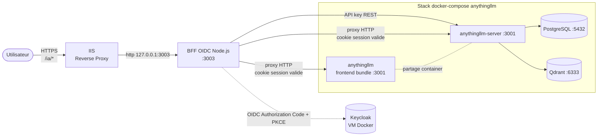
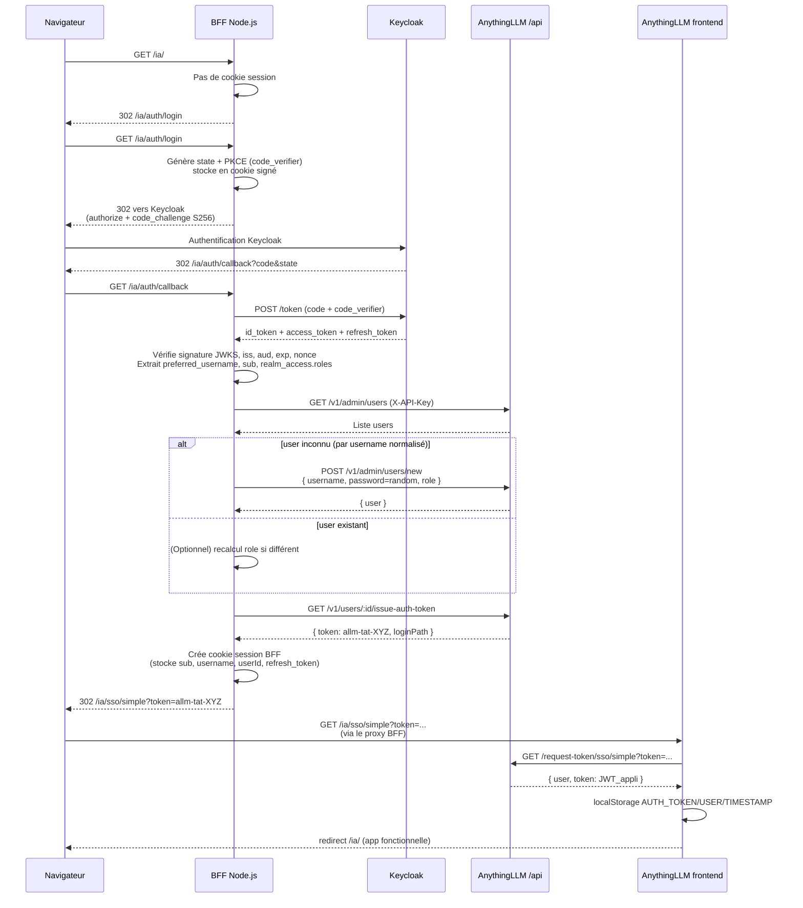
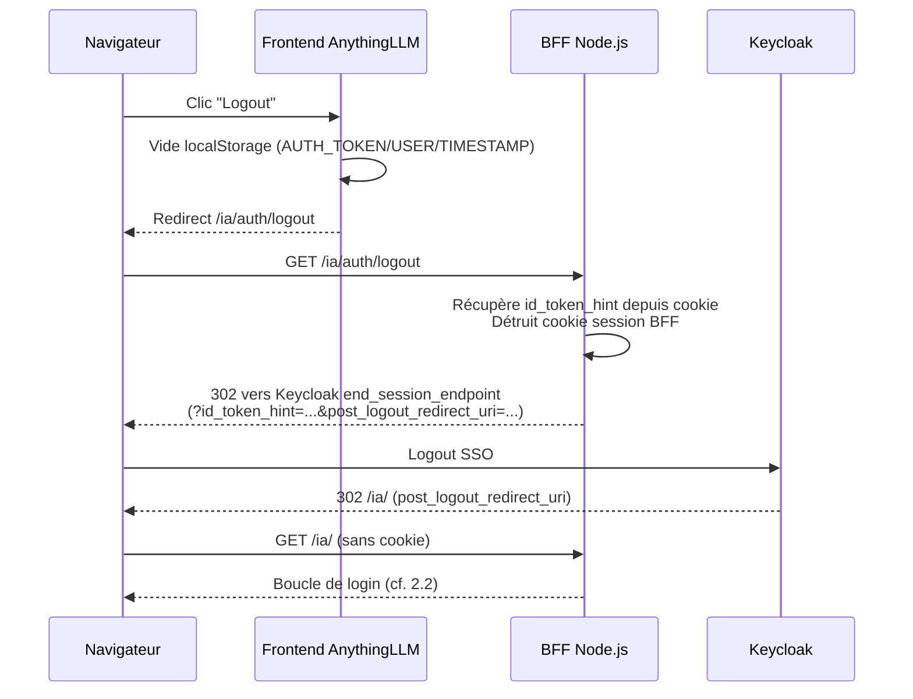

# Plan d'implémentation — Authentification OAuth 2.1 / Keycloak via BFF Node.js

> Objectif : protéger l'accès à AnythingLLM (frontend + backend) en déléguant
> l'authentification à un Keycloak existant, via un mini-service BFF Node.js
> intercalé en reverse-proxy. Aucun fork divergent du serveur AnythingLLM ;
> on s'appuie sur le mécanisme `Simple SSO Passthrough` déjà présent.

## Choix retenus avec l'utilisateur

| Question | Choix |
|---|---|
| Mapping des rôles | **Realm roles Keycloak** (`realm_access.roles`) |
| Logout | **Logout local + SLO Keycloak** (`end_session_endpoint`) |
| Provisionnement | **JIT à la première connexion** |
| Stockage session BFF | **Cookie signé stateless** (pas de Redis en phase 1) |
| Règle préfixe `IWS` | **Non applicable** (le BFF est en JS, la règle cible .NET) |

---

## 1. Contexte et points d'ancrage existants

Le code AnythingLLM expose déjà tout ce qu'il faut pour brancher un IdP externe
sans toucher au cœur du serveur :

| Élément existant | Fichier | Rôle dans le flow OIDC |
|---|---|---|
| Route frontend de callback SSO | `frontend/src/pages/Login/SSO/simple.jsx` | Reçoit `?token=...`, l'échange contre un JWT applicatif et le stocke en `localStorage` |
| Endpoint d'échange token temporaire → JWT session | `server/endpoints/system.js:336` (`GET /request-token/sso/simple`) | Valide le `TemporaryAuthToken`, renvoie `{ user, token }` |
| Modèle token temporaire (à usage unique, 6 min) | `server/models/temporaryAuthToken.js` | `issue(userId)` / `validate(token)` |
| Endpoint d'émission de token (par API key) | `server/endpoints/api/userManagement/index.js:67` (`GET /v1/users/:id/issue-auth-token`) | Génère un `allm-tat-...` à partir d'un user existant |
| Endpoint de création de user (par API key) | `server/endpoints/api/admin/index.js:85` (`POST /v1/admin/users/new`) | Création JIT côté AnythingLLM |
| Endpoint de listing users | `server/endpoints/api/admin/index.js:41` (`GET /v1/admin/users`) | Recherche d'un user existant par `username` |
| Désactivation login local | `server/utils/middleware/simpleSSOEnabled.js` | `SIMPLE_SSO_NO_LOGIN=true` désactive le formulaire mot de passe |
| Validation JWT applicatif | `server/utils/middleware/validatedRequest.js:71` | Vérifie `valid.id`, charge `User.get({ id })`, peuple `response.locals.user` |
| Regex username (contrainte forte) | `server/models/user.js:17` | `^[a-z][a-z0-9._@-]*$`, 2–32 chars |
| Rôles supportés | `server/models/user.js:52` | `default`, `manager`, `admin` |

Conséquence : le BFF n'a qu'à parler **OIDC côté Keycloak** et **API REST côté
AnythingLLM**. Aucune modification du serveur AnythingLLM n'est nécessaire.

---

## 2. Architecture cible

### 2.1 Schéma de déploiement Docker



Notes :
- IIS (déjà en place, cf. `IIS_SETUP.md`) reste le seul point d'entrée HTTPS
  public et fait du reverse-proxy vers le BFF uniquement (plus directement vers
  AnythingLLM). Le port `127.0.0.1:3001` continue d'écouter en loopback mais
  n'est plus exposé via IIS.
- Le BFF est exposé sur `127.0.0.1:3003` (loopback uniquement, comme l'actuel).
- Toutes les requêtes (HTML statique du frontend, API REST, websockets) passent
  par le BFF : le frontend hérite donc automatiquement de la protection.

### 2.2 Séquence d'authentification (login)



### 2.3 Séquence de logout (Single Logout)



---

## 3. Composant BFF Node.js — design détaillé

### 3.1 Stack technique

- **Runtime** : Node.js 20 LTS (image `node:20-alpine`).
- **Framework** : Express 4.
- **Lib OIDC** : [`openid-client`](https://github.com/panva/node-openid-client)
  (référence de l'écosystème, maintenue par le mainteneur de la spec OIDC).
  Gère PKCE, JWKS, `end_session_endpoint`, refresh.
- **Sessions** : `cookie-session` (stateless, cookie signé). Pas de Redis en
  phase 1 (cf. §7 décision validée).
- **Proxy HTTP** : `http-proxy-middleware` pour relayer les routes non-auth
  vers `http://anything-llm:3001`.
- **Logs** : `pino` (structuré JSON).
- **Sécurité** : `helmet`, cookies `Secure; HttpOnly; SameSite=Lax`.

Aucune dépendance propriétaire (conformité `vendor-protection.md`). L'interface
est OIDC standard, donc Keycloak est interchangeable avec Authentik / Zitadel /
Auth0.

### 3.2 Structure du projet

```
bff/
├── Dockerfile
├── package.json
├── package-lock.json
├── src/
│   ├── server.js                # bootstrap Express
│   ├── config.js                # parsing env + zod validation
│   ├── auth/
│   │   ├── oidcClient.js        # discovery + client openid-client
│   │   ├── routes.js            # /auth/login /auth/callback /auth/logout
│   │   └── session.js           # middleware require-session
│   ├── anythingllm/
│   │   ├── client.js            # wrapper REST (fetch + API key)
│   │   ├── userMapping.js       # claims OIDC -> users AnythingLLM
│   │   └── usernameNormalizer.js # respect du regex serveur
│   ├── proxy.js                 # http-proxy-middleware
│   └── logger.js
└── README.md
```

### 3.3 Routes exposées par le BFF

| Méthode | Chemin | Auth | Rôle |
|---|---|---|---|
| GET | `/ia/auth/login` | aucune | démarre le flow OIDC (PKCE + state) |
| GET | `/ia/auth/callback` | state cookie | échange code → tokens, JIT, émet token simple-sso, redirige vers `/ia/sso/simple?token=...` |
| GET | `/ia/auth/logout` | session | détruit session, redirige vers `end_session_endpoint` |
| GET | `/ia/auth/me` | session | (debug) renvoie claims utiles |
| GET | `/ia/healthz` | aucune | healthcheck |
| `*`   | `/ia/*` (le reste) | session | proxy vers `anything-llm:3001` |

Particularité : la route `/ia/sso/simple` est **transparente** côté BFF — c'est
juste du proxy, c'est le frontend AnythingLLM qui la traite.

### 3.4 Mapping claims OIDC → user AnythingLLM

| Claim Keycloak | Champ AnythingLLM | Transformation |
|---|---|---|
| `sub` | (clé externe interne au BFF) | utilisé pour la stratégie de cache et les logs ; pas de stockage en base AnythingLLM (pas de colonne `external_id` ajoutée pour rester upstream-compatible) |
| `preferred_username` | `users.username` | normalisé : lowercase, remplacement caractères hors regex par `_`, troncature 32 chars, fallback `u_<sub:8>` si vide |
| `email` | `users.bio` (préfixe `email:`) | optionnel, débuggable côté admin |
| `realm_access.roles` | `users.role` | `kc:anythingllm-admin` → `admin` ; `kc:anythingllm-manager` → `manager` ; sinon `default`. Mapping configurable par env |
| (random 32 bytes) | `users.password` | mot de passe inutilisé (login local désactivé via `SIMPLE_SSO_NO_LOGIN`) |

**Stratégie de réconciliation à chaque login (JIT) :**
1. `GET /v1/admin/users` → recherche par `username` normalisé.
2. Si absent → `POST /v1/admin/users/new` (création).
3. Si présent **et** `role` calculé ≠ `role` actuel **et** option
   `SYNC_ROLES_ON_LOGIN=true` → `POST /v1/admin/users/:id` pour mettre à jour le
   rôle. Sinon laisser tel quel (un admin local peut surcharger manuellement).
4. `GET /v1/users/:id/issue-auth-token` → token temporaire.
5. Redirect `/ia/sso/simple?token=...`.

### 3.5 Variables d'environnement du BFF

```env
# OIDC
OIDC_ISSUER=https://keycloak.example.tld/realms/nautilus
OIDC_CLIENT_ID=anythingllm
OIDC_CLIENT_SECRET=...
OIDC_REDIRECT_URI=https://app.example.tld/ia/auth/callback
OIDC_POST_LOGOUT_REDIRECT_URI=https://app.example.tld/ia/
OIDC_SCOPES=openid profile email

# Mapping rôles (claim source = realm_access.roles)
ROLE_CLAIM_SOURCE=realm_access.roles
ROLE_MAP_ADMIN=anythingllm-admin
ROLE_MAP_MANAGER=anythingllm-manager
SYNC_ROLES_ON_LOGIN=true

# AnythingLLM
ANYTHINGLLM_BASE_URL=http://anything-llm:3001
ANYTHINGLLM_API_KEY=...        # généré dans Admin > API Keys
ANYTHINGLLM_BASE_PATH=/ia      # cohérent avec le reste du déploiement

# BFF
BFF_PORT=3003
BFF_SESSION_SECRET=...         # >=32 bytes random
BFF_COOKIE_SECURE=true
BFF_COOKIE_DOMAIN=app.example.tld
BFF_TRUST_PROXY=true           # car derrière IIS
LOG_LEVEL=info
```

### 3.6 Sessions BFF

- Cookie nommé `bff.sid`, `HttpOnly`, `Secure`, `SameSite=Lax`, durée
  alignée sur le refresh token Keycloak (par défaut 30 min, refresh côté BFF).
- Contenu serveur (Redis ou cookie signé) : `sub`, `username`,
  `anythingLlmUserId`, `idToken` (pour SLO), `refreshToken`, `expiresAt`.
- Refresh token : avant expiration, le BFF appelle `refresh_token` côté KC.
  Si refresh échoue → 401 → frontend redirige vers `/ia/auth/login`.

### 3.7 Dockerfile (résumé)

```Dockerfile
FROM node:20-alpine
WORKDIR /app
COPY package*.json ./
RUN npm ci --omit=dev
COPY src ./src
USER node
EXPOSE 3003
CMD ["node", "src/server.js"]
```

---

## 4. Modifications du `docker/docker-compose.yml`

Ajouts (sans toucher aux services existants) :

```yaml
  bff-oidc:
    container_name: nautilusllm-bff
    build:
      context: ../bff
      dockerfile: Dockerfile
    env_file:
      - ./bff.env          # nouveau fichier env dédié
    ports:
      - "127.0.0.1:3003:3003"   # IIS proxysera vers ce port
    networks:
      - anything-llm
    depends_on:
      anything-llm:
        condition: service_started
    restart: unless-stopped
```

Et **modification** du service `anything-llm` :
- Retirer l'exposition `127.0.0.1:3001:3001` (laisser seulement le réseau
  interne `anything-llm`), ou la conserver pour debug local. Décision : la
  **conserver** mais mettre un commentaire pour signaler qu'IIS doit cibler
  `3003` désormais.
- Ajouter `SIMPLE_SSO_ENABLED=true` et `SIMPLE_SSO_NO_LOGIN=true` dans le
  fichier `.env` qui est déjà bind-mounté.

Aucune modification de `postgres`, `postgres-init`, `qdrant`.

---

## 5. Modifications côté IIS (`IIS_SETUP.md`)

Le fichier `IIS_SETUP.md` documente actuellement la règle de réécriture
qui pointe vers `http://127.0.0.1:3001`. Il faudra :
- Documenter le nouveau backend cible : `http://127.0.0.1:3003`.
- Ajouter une note sur le passage du header `X-Forwarded-Proto: https`
  (déjà nécessaire pour `BFF_TRUST_PROXY`).

> **Aucune modification de fichier IIS dans la phase d'implémentation initiale**
> — c'est une étape ops à exécuter manuellement après le déploiement du BFF.
> Seule la doc est mise à jour.

---

## 6. Configuration Keycloak (réalisée par l'admin Keycloak, hors code)

Documentée dans le `bff/README.md` :

1. Créer un client `anythingllm` :
   - Type : OpenID Connect, **confidentiel** (Client authentication ON).
   - Authorization Code + PKCE S256.
   - Standard flow ON, Direct access grants OFF, Service account OFF.
   - Valid redirect URIs : `https://app.example.tld/ia/auth/callback`.
   - Valid post logout redirect URIs : `https://app.example.tld/ia/`.
   - Web origins : `https://app.example.tld`.
2. Créer 3 realm roles : `anythingllm-admin`, `anythingllm-manager`,
   `anythingllm-user`.
3. Mapper les rôles `realm_access.roles` dans l'`id_token`
   (déjà par défaut sur Keycloak ≥ 18, à vérifier).
4. Affecter les rôles aux utilisateurs concernés.
5. Récupérer `client_id` et `client_secret` pour `bff.env`.

---

## 7. Décisions à arbitrer pendant l'implémentation

| Sujet | Option A | Option B | Recommandation |
|---|---|---|---|
| Stockage session BFF | ~~Redis~~ | **Cookie signé stateless** (choisi) | Validé : cookie signé `cookie-session`. Migration Redis prévue plus tard si besoin de révocation centrale. |
| Healthcheck BFF | `/healthz` simple liveness | `/healthz` + ping Keycloak discovery | **Liveness simple** ; le ping discovery se fait au boot et se cache. |
| Refresh token | Au prochain accès | Tâche planifiée | **Au prochain accès** (lazy), suffisant pour un usage interactif. |
| Image Docker | `node:20-alpine` | `node:20-bookworm-slim` | **Alpine** (plus petite ; openid-client n'a pas de dépendance native problématique). |

---

## 8. Tests d'acceptation

À valider manuellement après le déploiement :

1. **Premier login (JIT)** : utilisateur Keycloak inexistant dans
   AnythingLLM → après login OIDC, l'utilisateur est créé en base
   AnythingLLM avec le bon rôle, et arrive sur l'app loggé.
2. **Login rejouable** : déconnexion + reconnexion → pas de doublon en
   base, le même `users.id` est réutilisé.
3. **Mapping rôles** : ajouter le realm role `anythingllm-admin` à un
   utilisateur dans Keycloak → après reconnexion (avec
   `SYNC_ROLES_ON_LOGIN=true`), il devient admin dans AnythingLLM.
4. **Workspace assignment** : un admin local peut affecter un workspace
   au user provisionné (vérification via `GET /v1/admin/users` puis
   l'UI workspace).
5. **Protection backend** : un appel direct à
   `https://app.example.tld/ia/api/v1/system/...` sans cookie BFF doit
   retourner 302 vers `/ia/auth/login` (le BFF intercepte avant que la
   requête atteigne AnythingLLM).
6. **Protection frontend** : ouvrir `https://app.example.tld/ia/` en
   navigation privée → redirige vers Keycloak.
7. **Logout SLO** : clic logout depuis l'UI AnythingLLM → cookie BFF
   détruit + session Keycloak terminée (vérifié en re-tentant un login,
   on doit passer par la mire Keycloak).
8. **Refresh transparent** : laisser une session ouverte > durée d'access
   token → continuer à utiliser l'app sans re-prompt.
9. **Username impossible** : utilisateur Keycloak avec
   `preferred_username` non conforme (ex: `Jean.MARTIN`) → normalisation
   en `jean.martin`, création OK.
10. **Désactivation login local** : `https://app.example.tld/ia/login`
    n'affiche plus le formulaire mot de passe (404 ou redirect vers SSO).

---

## 9. Étapes d'implémentation (ordre suggéré)

1. **Bootstrapper le projet `bff/`** : `package.json`, deps, lint, `Dockerfile`, structure src/.
2. **Module `config.js`** : parsing + validation (zod) des variables d'env.
3. **Module `oidcClient.js`** : discovery + client `openid-client`.
4. **Routes `/auth/login` et `/auth/callback`** sans appel AnythingLLM (juste login + cookie session).
5. **Module `anythingllm/client.js`** + `usernameNormalizer.js`.
6. **JIT provisioning** dans `/auth/callback` (recherche, création, émission token, redirect simple-sso).
7. **Route `/auth/logout` avec SLO**.
8. **Proxy `http-proxy-middleware`** vers `anything-llm:3001`.
9. **Middleware require-session** sur tout sauf `/auth/*` et `/healthz`.
10. **Refresh token automatique** dans le middleware de session.
11. **Mise à jour `docker/docker-compose.yml`** : nouveau service `bff-oidc`, fichier `bff.env.example`.
12. **Mise à jour de `.env.example` (server)** : ajouter `SIMPLE_SSO_ENABLED`, `SIMPLE_SSO_NO_LOGIN`, doc API key.
13. **Documentation** : `bff/README.md` (config Keycloak, env, run local, debug) + ajout d'une section dans `IIS_SETUP.md` (cible 3003 au lieu de 3001).
14. **Tests d'acceptation** (cf. §8).

---

## 10. Risques et points de vigilance

| Risque | Mitigation |
|---|---|
| Header `Authorization` du BFF (cookie session) ↔ JWT applicatif AnythingLLM (autre `Authorization: Bearer`) | Le BFF utilise un **cookie**, pas un header. Le JWT AnythingLLM est en `localStorage` côté navigateur et envoyé par le frontend. Les deux coexistent sans collision. |
| Première création de l'API key (`ANYTHINGLLM_API_KEY`) | Bootstrap manuel : un admin se connecte initialement avec le mot de passe local **avant** d'activer `SIMPLE_SSO_NO_LOGIN`, génère une API key, puis on active SSO. Documenté dans le README. |
| WebSockets / streaming | `http-proxy-middleware` supporte `ws: true`. À activer explicitement pour `/api/workspace/*/stream-chat`. |
| `BASE_PATH=/ia` doit être homogène | Vérifier que `OIDC_REDIRECT_URI` inclut `/ia/auth/callback` et que toutes les routes du BFF sont préfixées. |
| Session BFF expire pendant un long stream | Le streaming envoie des chunks ; pas de pb tant que la connexion HTTP est ouverte. À tester. |
| Logout côté frontend AnythingLLM | Le bouton logout actuel ne sait pas appeler `/ia/auth/logout`. Soit on patch léger (1 ligne dans le composant logout), soit on documente un bookmark. **À trancher** lors de l'implémentation : préférer le patch léger. |
| Username collision | Deux utilisateurs Keycloak différents avec même `preferred_username` après normalisation → conflit P2002. Mitigation : suffixe `_<sub:6>` en cas de collision détectée. |
| Conformité `vendor-protection.md` | Keycloak est OSS. `openid-client` est lib OSS. Le BFF parle OIDC standard. ✅ |
| Conformité `rules-iws.md` (préfixe `IWS`) | Validé avec l'utilisateur : la règle cible .NET, **non appliquée** au BFF JavaScript. |

---

## 11. Livrables

- Un dossier `bff/` complet avec code, tests, Dockerfile, README.
- `docker/docker-compose.yml` modifié (nouveau service `bff-oidc`).
- `docker/bff.env.example` (template à copier en `bff.env`).
- `server/.env.example` complété (mention `SIMPLE_SSO_ENABLED` / `SIMPLE_SSO_NO_LOGIN`).
- `IIS_SETUP.md` mis à jour (cible 3003).
- Ce plan archivé dans `docs/architecture/auth-oidc.md` après implémentation
  (les diagrammes Mermaid des §2.1/2.2/2.3 deviennent la doc d'archi du projet).

---

## 12. Hors périmètre (à itérer plus tard)

- Stockage `external_id` Keycloak dans la table `users` (nécessiterait une
  migration Prisma et un fork de modèle ; conservé hors scope pour rester
  upstream-compatible).
- Synchronisation périodique des users supprimés/suspendus depuis Keycloak
  (job cron).
- Mode multi-tenant (plusieurs realms Keycloak).
- Support `mTLS` ou DPoP côté OIDC.
- Intégration des API keys AnythingLLM (`/v1/...`) avec OIDC : non concerné,
  les API keys restent indépendantes pour les usages machine-à-machine.
