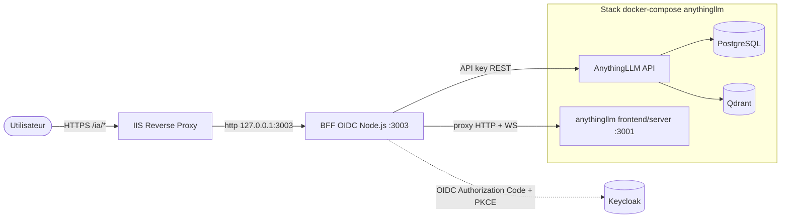
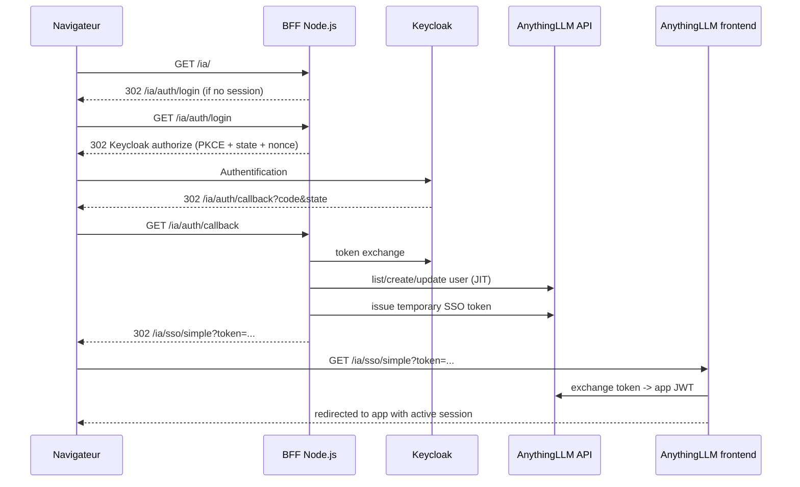
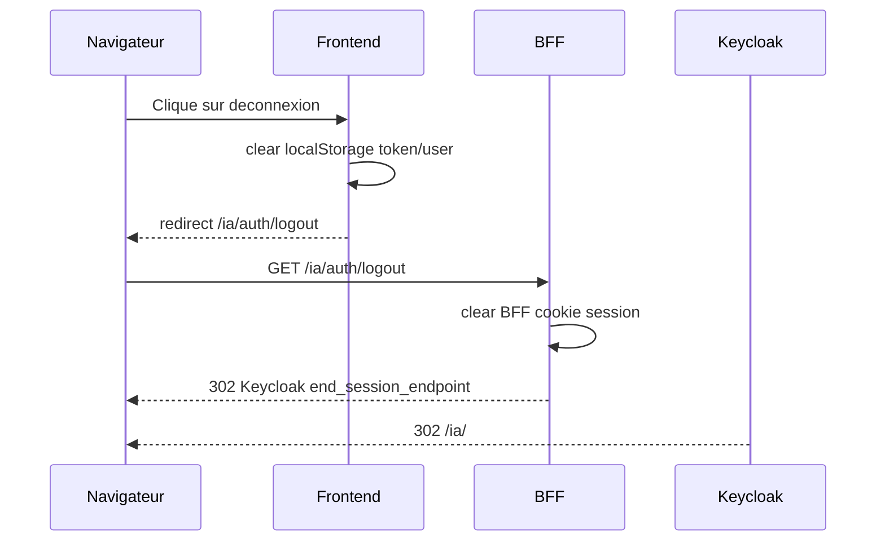

# Architecture - OIDC via BFF Node.js

Ce document archive le plan d'implementation de `.kilo/plans/1779376925696-eager-cabin.md` et decrit l'architecture livree.

## Decisions finales

- Source du mapping des roles : Keycloak `realm_access.roles`.
- Mode de deconnexion : deconnexion locale du BFF + SLO Keycloak (`end_session_endpoint`).
- Mode de provisionnement : JIT a la premiere connexion.
- Stockage de session BFF : cookie stateless signe (`cookie-session`).
- Regle de prefixe de methode `IWS` : non appliquee (le BFF est en JavaScript ; la regle cible .NET).

## Schema de deploiement

## Sequence de connexion

## Sequence de deconnexion (SLO)

## Notes

- Le serveur AnythingLLM n'a pas ete fork. L'integration utilise les API publiques existantes ainsi que le passthrough Simple SSO existant.
- La cible IIS a ete changee vers `127.0.0.1:3003` (BFF), tandis que `127.0.0.1:3001` reste utilise pour le local/debug.
- La coherence de `BASE_PATH=/ia` est requise entre AnythingLLM, les routes du BFF et les URI de redirection Keycloak.
